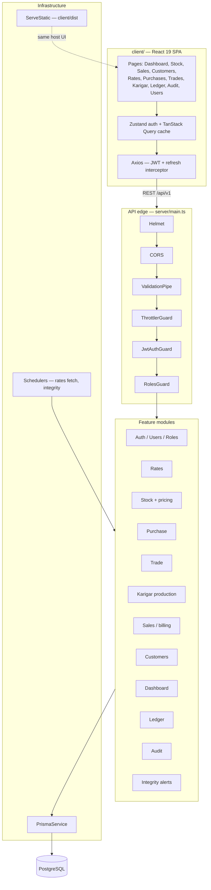
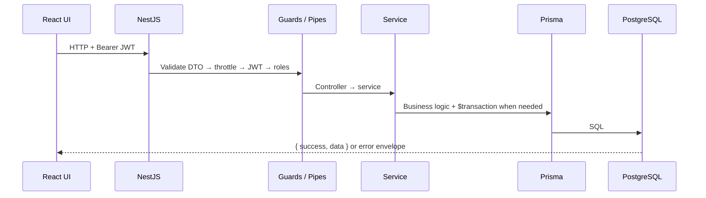

# JewelryFlow ERP

**A jewelry-shop management system built for Nepali jewelers** — digitizing the traditional physical ledger (*bahikhata*) with inventory, daily rates, sales billing, karigar production, supplier trade, and role-based access.

| | |
|---|---|
| **UI + API** | http://localhost:4000 (Docker or local install) |
| **API prefix** | `/api/v1` |
| **API docs (dev)** | http://localhost:4000/docs |
| **Default login** | `owner@jewelryflow.test` / `password123` |

> Change the default owner password immediately after first login.

---

## Table of contents

1. [The problem](#1-the-problem)
2. [The solution](#2-the-solution)
3. [Who it’s for](#3-who-its-for)
4. [High-level architecture](#4-high-level-architecture)
5. [Design principles](#5-design-principles)
6. [Tech stack (and why)](#6-tech-stack-and-why)
7. [Core modules](#7-core-modules)
8. [Data model overview](#8-data-model-overview)
9. [Security & access control](#9-security--access-control)
10. [Data integrity & safety](#10-data-integrity--safety)
11. [Project structure](#11-project-structure)
12. [Getting started](#12-getting-started)
13. [Development workflow](#13-development-workflow)
14. [Testing](#14-testing)
15. [Further reading](#15-further-reading)

---

## 1. The problem

Nepali jewelry shops traditionally run on **paper ledgers**, memory, and informal trust. That creates real operational risk:

| Pain | Why it hurts |
|------|----------------|
| **Daily rate volatility** | Gold/silver prices change daily. Wrong rate on a bill means loss or dispute. |
| **Weight is multi-unit** | Shops think in **tola / lal / gram**. Spreadsheets and generic ERPs rarely model this correctly. |
| **Karigar (craftsman) metal loss** | Raw metal goes out; finished pieces come back. Wastage, disputes, and payment tracking are hard on paper. |
| **Stock identity** | Every piece has weight, karat, making charges (*jyala*), impurities (*jerty*), stones, and status. Losing the trail of a sold item is expensive. |
| **Billing complexity** | Sell, return, exchange, buy-back, and old-gold — often in one customer visit — with discounts, taxes, and Nepali rounding rules. |
| **Supplier trade** | Some parties exchange raw metal for finished goods; others sell finished stock. Different flows, same shop. |
| **Access control** | Owner, manager, and staff need different powers. Paper systems have none. |
| **Audit & trust** | When numbers don’t match, shops need a trail — who changed a rate, who sold which SKU, when a bill was paid. |

Generic retail or accounting software does not encode jewelry-domain rules (triple weight units, jerty/jyala, karigar wastage, FENEGOSIDA-style rate culture, NPR bill rounding). Shops either patch spreadsheets or stay on paper.

---

## 2. The solution

**JewelryFlow** is a purpose-built ERP that replaces the physical ledger with a single system of record for the shop floor:

- **Morning rates** — set (or fetch) today’s buy/sell rates before sales start  
- **Stock as first-class inventory** — every piece tracked with weights, pricing inputs, origin, and lifecycle status  
- **Sales & billing** — full transaction types with line items, payments, discounts, and domain rounding  
- **Purchase & trade** — receive finished goods from suppliers, or trade raw metal for finished pieces  
- **Karigar production** — issue metal, record returns, track tolerance/wastage, payments, and disputes  
- **Customers & ledgers** — customer history, outstanding balances, gold movement views  
- **RBAC** — OWNER / MANAGER / STAFF with permission-backed roles  
- **Audit & integrity** — transaction audit log, scheduled integrity checks, DB-level bulk-delete guards, backups  

It is designed to run **locally** (shop PC or small server) — including via Docker — so the shop is not dependent on a cloud SaaS for core operations.

---

## 3. Who it’s for

| Role | Typical use |
|------|-------------|
| **Shop owner** | Rates, users, audit, ledgers, full visibility |
| **Manager** | Stock, purchases, karigar, sales, trades |
| **Staff** | Sales support, lookups, limited write access |

Primary market context: **Nepali jewelry retail** (NPR currency, tola/lal culture, karigar workflows).

---

## 4. High-level architecture

JewelryFlow is a **two-tier monolith**: one NestJS backend and one React SPA. In production/Docker, Nest also **serves the built frontend**, so users hit a single origin (`localhost:4000`).



### Request lifecycle



### Deployment shapes

| Mode | How it runs |
|------|-------------|
| **Docker (recommended for sharing)** | `docker compose` → Postgres + app image (API + UI) |
| **Native Windows install** | Local Node + local PostgreSQL; `start-jewelryflow.bat` |
| **Dev split** | Vite on `:5173` proxies `/api` → Nest on `:4000` |

---

## 5. Design principles

These principles shaped the schema and module boundaries:

### Domain-first, not generic retail

Jewelry rules live in the product: triple weight storage (gram / tola / lal), jerty & jyala, karat/SKU conventions, karigar issue/return, and Nepali bill rounding. The domain drives the schema — not the other way around.

### Atomic money & metal movements

Sales, stock status flips, payments, and related writes use **database transactions** where consistency matters. A sold item should not remain `IN_STOCK`; a bill and its lines should commit together.

### Immutable billing history

Customer name/phone snapshots on transactions, bill numbers from a **PostgreSQL sequence** (not `COUNT(*)`), and audit entries preserve history even if master data later changes.

### Clear module boundaries

Each Nest module owns a business capability (stock, sales, karigar, …). Controllers stay thin; services hold rules; Prisma is the persistence boundary.

### Explicit RBAC

Global JWT auth + `@Roles(...)` on endpoints. Permissions are seeded and assigned via roles — not hardcoded checks scattered through UI alone.

### Fail closed on dangerous ops

- Seed blocked unless DB name looks like `_dev` / `local` / `test`  
- `migrate reset` wrapped with confirmations (test DB only)  
- Bulk-delete triggers on critical tables (skipped in `*test*` databases)  
- Migrations prefer a backup first (`db:migrate` → backup then migrate)

### Local-first operability

Shops should run without mandatory cloud. Docker and Windows installers package the same product. Optional internet features (rate fetch, SMTP OTP) degrade gracefully when offline.

### Observability of data health

Integrity checks compare row-count baselines and domain invariants (orphaned sold stock, duplicate current rates, etc.) and can surface OWNER alerts — a safety net against silent data loss.

---

## 6. Tech stack (and why)

### Backend

| Technology | Role | Why this choice |
|------------|------|-----------------|
| **Node.js** | Runtime | Fast iteration; one language across tooling; good Windows/Docker ergonomics for small-shop deploy |
| **NestJS 10** | API framework | Opinionated modules, DI, guards/pipes/interceptors — fits multi-module ERP without inventing structure |
| **TypeScript (strict)** | Language | Money/weight bugs are expensive; types catch contract mistakes early |
| **PostgreSQL** | Database | ACID transactions, constraints, sequences, triggers — required for billing/inventory integrity |
| **Prisma 5** | ORM + migrations | Type-safe queries, explicit migrations, readable schema as documentation |
| **Passport JWT** | Auth | Stateless API auth for SPA; refresh flow for shop-day sessions |
| **class-validator / class-transformer** | DTO validation | Reject bad payloads at the edge before business logic runs |
| **Swagger** | API docs | Interactive contract for frontend and integrators (`/docs` in non-production) |
| **Jest** | Unit + integration tests | Real Postgres integration suite for sales/stock/karigar-critical paths |
| **@nestjs/schedule** | Cron | Daily rate fetch + nightly integrity sweep (Asia/Kathmandu) |
| **Helmet + Throttler** | Hardening | Baseline HTTP hardening and abuse rate limits |
| **bcrypt** | Password hashing | Industry-standard password storage |
| **nodemailer** | Email | Optional OTP / verification when SMTP is configured |

### Frontend

| Technology | Role | Why this choice |
|------------|------|-----------------|
| **React 19** | UI library | Component model matches dense operational screens (sales, stock, karigar) |
| **Vite** | Build tooling | Fast local DX; simple production build into `client/dist` |
| **React Router 7** | Routing | Role-aware page guards for shop navigation |
| **TanStack Query** | Server state | Caching, refetch, and loading states for list/detail ERP screens |
| **Zustand** | Client state | Lightweight auth/session state without Redux ceremony |
| **Axios** | HTTP | Interceptors for bearer token + refresh |
| **React Hook Form + Zod** | Forms | Complex bills and stock entry need reliable client validation |
| **Tailwind CSS** | Styling | Rapid, consistent UI for internal tools without a heavy design system |

### Infrastructure & delivery

| Technology | Role | Why this choice |
|------------|------|-----------------|
| **Docker + Compose** | Local/shareable deploy | One command for other machines — no separate Node/Postgres install |
| **pg_dump backups** | Data safety | Shop data is irreplaceable; backup-before-migrate and weekly dumps |
| **Serve-static from Nest** | Single-port UX | Shop users open one URL; reverse-proxy complexity stays optional |

### Why *not* a microservices / heavy cloud stack?

For a single-shop (or small multi-counter) ERP, a **modular monolith** keeps deployments, transactions, and debugging simple. Cross-module invariants (stock ↔ sales ↔ audit) are easier with one Postgres and one deployable than with distributed services.

---

## 7. Core modules

| Module | Responsibility |
|--------|----------------|
| **Auth / Users / Roles** | Signup, login, JWT refresh, password flows, RBAC admin |
| **Rates** | Daily buy/sell rates per metal; history; optional scheduled fetch |
| **Stock** | Inventory, SKUs by origin, price preview, categories, status lifecycle |
| **Purchase** | Suppliers + purchase orders → receive into stock |
| **Trade** | Raw metal ↔ finished goods with trade parties |
| **Karigar** | Production orders, metal issue/return, payments, disputes, balances |
| **Sales** | SELL / RETURN / EXCHANGE / BUY_BACK / OLD_GOLD, payments, discounts, rounding |
| **Customer** | Registry, phone lookup, transaction history & summary |
| **Dashboard** | Today’s KPIs, rates status, pending work |
| **Ledger** | Gold movement and customer balance views |
| **Audit** | Transaction / rate change history for OWNER |
| **Integrity** | Scheduled checks + OWNER alert list |
| **Export / Import** | Spreadsheet templates and bulk import paths |

---

## 8. Data model overview

- **~30+ Prisma models**, versioned SQL migrations  
- **Money:** NPR as `Decimal`  
- **Weight:** stored in **gram, tola, and lal** together (master calculations use gram)  
- **Stock origins:** `DIRECT`, `PURCHASED`, `KARIGAR`, `TRADE`, `REMAKE`  
- **Stock statuses:** `IN_STOCK`, `RESERVED`, `SOLD`, `RETURNED`, `SCRAPPED`, `UNDER_DISPUTE`, `IN_REMAKE`, `REMADE`  

Major relationship groups:

```text
Users / Roles / Permissions
MetalType → DailyRate
ItemCategory → StockItem (+ addons)
Supplier → PurchaseOrder → lines → StockItem
Supplier/TradeParty → Trade → TradeItem → StockItem
Karigar → ProductionOrder → Issue / Return / Lines → StockItem
Customer → Transaction → Lines / Payments / Buyback
Transaction ↔ AuditLog
```

Schema source of truth: [`server/prisma/schema.prisma`](server/prisma/schema.prisma).

---

## 9. Security & access control

| Layer | Behavior |
|-------|----------|
| **Transport** | Helmet headers; CORS allowlist via `ALLOWED_ORIGINS` |
| **Auth** | JWT access token + refresh; passwords hashed with bcrypt |
| **Authorization** | Global `JwtAuthGuard`; endpoint `@Roles('OWNER'|'MANAGER'|'STAFF')` |
| **Input** | ValidationPipe whitelist + forbid unknown fields |
| **Abuse** | Throttler (~100 req/min default) |
| **Secrets** | `.env` / Compose env — never commit real credentials |

Roles (seeded):

- **OWNER** — full access including audit, users, integrity alerts  
- **MANAGER** — day-to-day operations  
- **STAFF** — constrained operational access  

---

## 10. Data integrity & safety

JewelryFlow treats shop data as high-value:

| Mechanism | Purpose |
|-----------|---------|
| **Prisma migrations** | Schema history is explicit and repeatable |
| **Bill number sequence** | Avoids collisions under concurrency / after deletes |
| **Bulk-delete DB triggers** | Blocks accidental `DELETE` of >10 rows on `transactions`, `stock_items`, `customers` (disabled automatically in `*test*` DBs) |
| **Integrity check script** | Row-count baselines + consistency checks (`npm run db:integrity-check`) |
| **Nightly integrity cron** | Logs FAIL/WARN; persists OWNER-visible alerts |
| **Backup scripts** | `db:backup` / Compose volume; migrate runs backup first |
| **Seed / reset guards** | Prevent wiping the wrong database |

---

## 11. Project structure

```text
ERP/
├── client/                 # React SPA (Vite)
│   └── src/
│       ├── api/            # Axios client + service wrappers
│       ├── pages/          # Feature screens
│       ├── stores/         # Zustand
│       └── components/     # Shared UI
├── server/                 # NestJS API
│   ├── prisma/             # schema, migrations, seed
│   ├── scripts/            # backup, integrity, safe reset
│   └── src/
│       ├── auth/, stock/, sales/, …   # feature modules
│       ├── common/         # guards, filters, utils, integrity runner
│       └── main.ts
├── docker/                 # container entrypoint
├── docker-compose.yml
├── Dockerfile
├── README-DOCKER.md        # Docker runbook
├── README-LOCAL-INSTALL.md # Native Windows install
└── README.md               # this file
```

---

## 12. Getting started

### Option A — Docker (recommended for other machines)

Requires [Docker Desktop](https://www.docker.com/products/docker-desktop/).

```bash
copy .env.docker.example .env   # Windows
# cp .env.docker.example .env   # macOS / Linux

docker compose up --build -d
```

Open **http://localhost:4000**.

Details: [README-DOCKER.md](./README-DOCKER.md)  
Windows helpers: `start-jewelryflow-docker.bat` / `stop-jewelryflow-docker.bat`

### Option B — Native Windows install

Requires Node.js LTS + PostgreSQL. Follow [README-LOCAL-INSTALL.md](./README-LOCAL-INSTALL.md), then use `start-jewelryflow.bat`.

### Default credentials

| Field | Value |
|-------|--------|
| Email | `owner@jewelryflow.test` |
| Password | `password123` |

---

## 13. Development workflow

```bash
# Backend
cd server
cp .env.example .env          # set DATABASE_URL, JWT_SECRET, …
npm install
npx prisma migrate deploy
npm run db:seed
npm run start:dev             # API on :4000

# Frontend (separate terminal)
cd client
cp .env.example .env          # VITE_API_URL=/api/v1
npm install
npm run dev                   # Vite on :5173 (proxies /api → :4000)
```

Useful server scripts:

| Script | Purpose |
|--------|---------|
| `npm run db:migrate` | Backup then `prisma migrate dev` |
| `npm run db:backup` / `db:restore` | Dump / restore Postgres |
| `npm run db:integrity-check` | Run integrity suite |
| `npm run db:reset` | Safe reset wrapper (test DB only) |
| `npm run test:integration` | Integration tests (needs `.env.test` → `jewelryflow_test`) |

---

## 14. Testing

- **Unit tests** — Jest under `server/src/**/*.spec.ts`  
- **Integration tests** — separate Postgres database `jewelryflow_test` (never point tests at `_dev`)  
- Setup: `npm run db:test:create` → `npm run db:test:setup` → `npm run test:integration`  

See [server/README_INTEGRATION_TESTS.md](./server/README_INTEGRATION_TESTS.md).

---

## 15. Further reading

| Document | Contents |
|----------|----------|
| [README-DOCKER.md](./README-DOCKER.md) | Docker day-to-day operations |
| [README-LOCAL-INSTALL.md](./README-LOCAL-INSTALL.md) | Windows native install for shop PCs |
| [architecture_breakdown.md](./architecture_breakdown.md) | Deep backend architecture walkthrough |
| [SYSTEM_ARCHITECTURE_AND_ROADMAP.md](./SYSTEM_ARCHITECTURE_AND_ROADMAP.md) | Module inventory & roadmap notes |
| [server/ARCHITECTURE.md](./server/ARCHITECTURE.md) | Backend module detail |
| [server/prisma/schema.prisma](./server/prisma/schema.prisma) | Canonical data model |

---

## License & status

Private project (`server` / `client` package.json: `"private": true`).  
Built as a production-oriented modular monolith for jewelry retail operations in Nepal.
